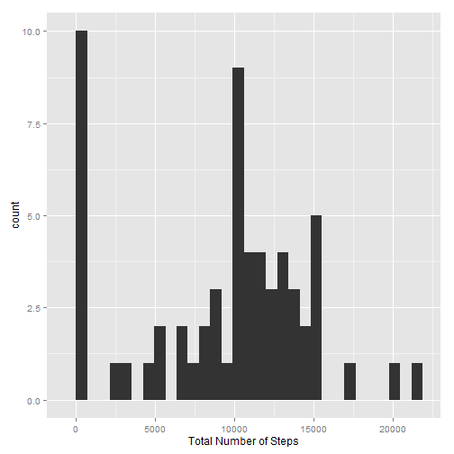
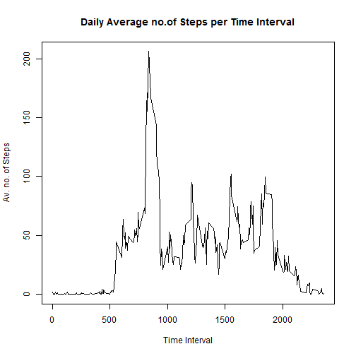
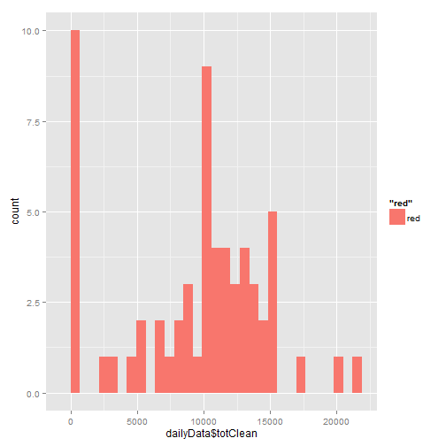
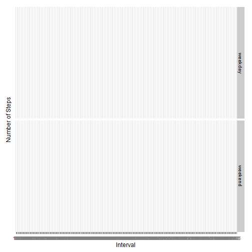

```r
rm(list=ls())
options(stringsAsFactors = FALSE)
Sys.setlocale("LC_TIME", "English")
```

```
## [1] "English_United States.1252"
```

```r
if (!is.element("ggplot2",installed.packages()) ) {install.packages("ggplot2")}
library(ggplot2)
```


##      Loading and Preprocessing the Data


```r
if (!file.exists("activity.csv")) {unzip("activity.zip")}

dataAct<-read.csv("activity.csv")
```


##      Mean Total Number of Steps Taken Per Day

```r
dailyData <-data.frame(date=character(length(levels(as.factor( dataAct$date)))))
dailyData$date<-unique(dataAct$date)
dailyData$tot<-tapply(dataAct$steps,dataAct$date,sum,na.rm=TRUE)

##      Histogram of the total number of steps taken per day
q<- qplot(dailyData$tot,col="red")
print(q)
```

 

```r
##      The mean and median of the total number of steps taken per day     

dailyData$mean<-tapply(dataAct$steps,dataAct$date,mean,na.rm=TRUE)
dailyData$median<-tapply(dataAct$steps,dataAct$date,median)
```
The mean of the number of steps taken per day  is
  
The median of the number of steps taken per day  is 
  

## The Average Daily Activity Pattern

```r
##    compute the plot
##

avInterval<-tapply(dataAct$steps,as.factor(dataAct$interval),mean,na.rm=TRUE)


tmp<-cbind(levels(factor(dataAct$interval)),avInterval)
plot (tmp[,1],tmp[,2],type="l",main="Daily Average no.of Steps per Time Interval",
      ylab="Av. no. of Steps",xlab="Time Interval")
```

 

```r
##      Which 5-minute interval, on average across all the days in the dataset, 
##      contains the maximum number of steps?

maxNoSteps<-max(as.numeric(tmp[,2]))
intervalofMax<-tmp[match(maxNoSteps,tmp[,2]),1]
intervalofMax
```

```
## [1] "835"
```

The time of day of the interval with maximum avergae steps is 835  

## Calculate and Report the Total Number of Missing Values in the Dataset


```r
naVec<-apply(as.matrix(dataAct), 2, function(x) sum(is.na(x)))
naVec[1]
```

```
## steps 
##  2304
```
total number of missing cases is 2304  

The strategy of replacing NA's is to use the average for that day, unless all  
the values of the day are NA,s. Than it is replaced by 0.

```r
##      Filling in all of the missing values in the dataset.
##      Using the average for that day, 
##      replicate the data into clean data frame
cleanDataAct<-dataAct
#cleanDataAct$date<-as.factor(cleanDataAct$date)

##      Calculate daily average
##      
dailyData$av <- tapply(dataAct$steps,as.factor(dataAct$date),mean,na.rm=TRUE)
##      if the average column contains NA's it is because the input to the mean function us all NA's.
##      In that case it should be 0 as the total function
dailyData$av[is.na(dailyData$av)]<-0

##      Calculate the indices of NA values in steps vector

naInd<-which(is.na(cleanDataAct$steps))
a<-cleanDataAct$date[naInd]
cleanDataAct$steps[naInd]<-dailyData$av[cleanDataAct$date[naInd]]


##     Make a histogram of the total number of steps taken each day and
##     __________________________________________________________________
##     
dailyData$totClean<-tapply(cleanDataAct$steps,cleanDataAct$date,sum)
q<-qplot(dailyData$totClean,fill="red")
print(q)
```

 

```r
##     The mean and median total number of steps taken per day
##     __________________________________________________________

dailyData$meanClean<-tapply(cleanDataAct$steps,cleanDataAct$date,mean)
dailyData$medianClean<-tapply(cleanDataAct$steps,cleanDataAct$date,median)

print(dailyData$meanClean)
```

```
## 01/10/2012 01/11/2012 02/10/2012 02/11/2012 03/10/2012 03/11/2012 
##  0.0000000  0.0000000  0.4375000 36.8055556 39.4166667 36.7048611 
## 04/10/2012 04/11/2012 05/10/2012 05/11/2012 06/10/2012 06/11/2012 
## 42.0694444  0.0000000 46.1597222 36.2465278 53.5416667 28.9375000 
## 07/10/2012 07/11/2012 08/10/2012 08/11/2012 09/10/2012 09/11/2012 
## 38.2465278 44.7326389  0.0000000 11.1770833 44.4826389  0.0000000 
## 10/10/2012 10/11/2012 11/10/2012 11/11/2012 12/10/2012 12/11/2012 
## 34.3750000  0.0000000 35.7777778 43.7777778 60.3541667 37.3784722 
## 13/10/2012 13/11/2012 14/10/2012 14/11/2012 15/10/2012 15/11/2012 
## 43.1458333 25.4722222 52.4236111  0.0000000 35.2048611  0.1423611 
## 16/10/2012 16/11/2012 17/10/2012 17/11/2012 18/10/2012 18/11/2012 
## 52.3750000 18.8923611 46.7083333 49.7881944 34.9166667 52.4652778 
## 19/10/2012 19/11/2012 20/10/2012 20/11/2012 21/10/2012 21/11/2012 
## 41.0729167 30.6979167 36.0937500 15.5277778 30.6284722 44.3993056 
## 22/10/2012 22/11/2012 23/10/2012 23/11/2012 24/10/2012 24/11/2012 
## 46.7361111 70.9270833 30.9652778 73.5902778 29.0104167 50.2708333 
## 25/10/2012 25/11/2012 26/10/2012 26/11/2012 27/10/2012 27/11/2012 
##  8.6527778 41.0902778 23.5347222 38.7569444 35.1354167 47.3819444 
## 28/10/2012 28/11/2012 29/10/2012 29/11/2012 30/10/2012 30/11/2012 
## 39.7847222 35.3576389 17.4236111 24.4687500 34.0937500  0.0000000 
## 31/10/2012 
## 53.5208333
```

```r
print(dailyData$medianClean)
```

```
## 01/10/2012 01/11/2012 02/10/2012 02/11/2012 03/10/2012 03/11/2012 
##          0          0          0          0          0          0 
## 04/10/2012 04/11/2012 05/10/2012 05/11/2012 06/10/2012 06/11/2012 
##          0          0          0          0          0          0 
## 07/10/2012 07/11/2012 08/10/2012 08/11/2012 09/10/2012 09/11/2012 
##          0          0          0          0          0          0 
## 10/10/2012 10/11/2012 11/10/2012 11/11/2012 12/10/2012 12/11/2012 
##          0          0          0          0          0          0 
## 13/10/2012 13/11/2012 14/10/2012 14/11/2012 15/10/2012 15/11/2012 
##          0          0          0          0          0          0 
## 16/10/2012 16/11/2012 17/10/2012 17/11/2012 18/10/2012 18/11/2012 
##          0          0          0          0          0          0 
## 19/10/2012 19/11/2012 20/10/2012 20/11/2012 21/10/2012 21/11/2012 
##          0          0          0          0          0          0 
## 22/10/2012 22/11/2012 23/10/2012 23/11/2012 24/10/2012 24/11/2012 
##          0          0          0          0          0          0 
## 25/10/2012 25/11/2012 26/10/2012 26/11/2012 27/10/2012 27/11/2012 
##          0          0          0          0          0          0 
## 28/10/2012 28/11/2012 29/10/2012 29/11/2012 30/10/2012 30/11/2012 
##          0          0          0          0          0          0 
## 31/10/2012 
##          0
```

The mean of the clean data is 0, 0, 0.4375, 36.8055556, 39.4166667, 36.7048611, 42.0694444, 0, 46.1597222, 36.2465278, 53.5416667, 28.9375, 38.2465278, 44.7326389, 0, 11.1770833, 44.4826389, 0, 34.375, 0, 35.7777778, 43.7777778, 60.3541667, 37.3784722, 43.1458333, 25.4722222, 52.4236111, 0, 35.2048611, 0.1423611, 52.375, 18.8923611, 46.7083333, 49.7881944, 34.9166667, 52.4652778, 41.0729167, 30.6979167, 36.09375, 15.5277778, 30.6284722, 44.3993056, 46.7361111, 70.9270833, 30.9652778, 73.5902778, 29.0104167, 50.2708333, 8.6527778, 41.0902778, 23.5347222, 38.7569444, 35.1354167, 47.3819444, 39.7847222, 35.3576389, 17.4236111, 24.46875, 34.09375, 0, 53.5208333  
The median of the clean data is 0, 0, 0, 0, 0, 0, 0, 0, 0, 0, 0, 0, 0, 0, 0, 0, 0, 0, 0, 0, 0, 0, 0, 0, 0, 0, 0, 0, 0, 0, 0, 0, 0, 0, 0, 0, 0, 0, 0, 0, 0, 0, 0, 0, 0, 0, 0, 0, 0, 0, 0, 0, 0, 0, 0, 0, 0, 0, 0, 0, 0 


```r
##     Do these values differ from the estimates from the first part of the 
##     assignment? 
##     ______________________________________________________________________

dailyData$meanDIff<- dailyData$meanClean - dailyData$mean
dailyData$medianDiff<- dailyData$medianClean - dailyData$median

print(dailyData$meanDIff)
```

```
## 01/10/2012 01/11/2012 02/10/2012 02/11/2012 03/10/2012 03/11/2012 
##        NaN        NaN          0          0          0          0 
## 04/10/2012 04/11/2012 05/10/2012 05/11/2012 06/10/2012 06/11/2012 
##          0        NaN          0          0          0          0 
## 07/10/2012 07/11/2012 08/10/2012 08/11/2012 09/10/2012 09/11/2012 
##          0          0        NaN          0          0        NaN 
## 10/10/2012 10/11/2012 11/10/2012 11/11/2012 12/10/2012 12/11/2012 
##          0        NaN          0          0          0          0 
## 13/10/2012 13/11/2012 14/10/2012 14/11/2012 15/10/2012 15/11/2012 
##          0          0          0        NaN          0          0 
## 16/10/2012 16/11/2012 17/10/2012 17/11/2012 18/10/2012 18/11/2012 
##          0          0          0          0          0          0 
## 19/10/2012 19/11/2012 20/10/2012 20/11/2012 21/10/2012 21/11/2012 
##          0          0          0          0          0          0 
## 22/10/2012 22/11/2012 23/10/2012 23/11/2012 24/10/2012 24/11/2012 
##          0          0          0          0          0          0 
## 25/10/2012 25/11/2012 26/10/2012 26/11/2012 27/10/2012 27/11/2012 
##          0          0          0          0          0          0 
## 28/10/2012 28/11/2012 29/10/2012 29/11/2012 30/10/2012 30/11/2012 
##          0          0          0          0          0        NaN 
## 31/10/2012 
##          0
```

```r
print(dailyData$medianDiff)
```

```
## 01/10/2012 01/11/2012 02/10/2012 02/11/2012 03/10/2012 03/11/2012 
##         NA         NA          0          0          0          0 
## 04/10/2012 04/11/2012 05/10/2012 05/11/2012 06/10/2012 06/11/2012 
##          0         NA          0          0          0          0 
## 07/10/2012 07/11/2012 08/10/2012 08/11/2012 09/10/2012 09/11/2012 
##          0          0         NA          0          0         NA 
## 10/10/2012 10/11/2012 11/10/2012 11/11/2012 12/10/2012 12/11/2012 
##          0         NA          0          0          0          0 
## 13/10/2012 13/11/2012 14/10/2012 14/11/2012 15/10/2012 15/11/2012 
##          0          0          0         NA          0          0 
## 16/10/2012 16/11/2012 17/10/2012 17/11/2012 18/10/2012 18/11/2012 
##          0          0          0          0          0          0 
## 19/10/2012 19/11/2012 20/10/2012 20/11/2012 21/10/2012 21/11/2012 
##          0          0          0          0          0          0 
## 22/10/2012 22/11/2012 23/10/2012 23/11/2012 24/10/2012 24/11/2012 
##          0          0          0          0          0          0 
## 25/10/2012 25/11/2012 26/10/2012 26/11/2012 27/10/2012 27/11/2012 
##          0          0          0          0          0          0 
## 28/10/2012 28/11/2012 29/10/2012 29/11/2012 30/10/2012 30/11/2012 
##          0          0          0          0          0         NA 
## 31/10/2012 
##          0
```
The difference of the mean without NA's is NaN, NaN, 0, 0, 0, 0, 0, NaN, 0, 0, 0, 0, 0, 0, NaN, 0, 0, NaN, 0, NaN, 0, 0, 0, 0, 0, 0, 0, NaN, 0, 0, 0, 0, 0, 0, 0, 0, 0, 0, 0, 0, 0, 0, 0, 0, 0, 0, 0, 0, 0, 0, 0, 0, 0, 0, 0, 0, 0, 0, 0, NaN, 0   
The difference of the median without NA's is 

```r
##     What is the impact of inputing missing data on the 
##     estimates of the total daily number of steps? 
## 
dailyData$totDIff<- dailyData$totClean - dailyData$tot
print(dailyData$totDIff)
```

```
## 01/10/2012 01/11/2012 02/10/2012 02/11/2012 03/10/2012 03/11/2012 
##          0          0          0          0          0          0 
## 04/10/2012 04/11/2012 05/10/2012 05/11/2012 06/10/2012 06/11/2012 
##          0          0          0          0          0          0 
## 07/10/2012 07/11/2012 08/10/2012 08/11/2012 09/10/2012 09/11/2012 
##          0          0          0          0          0          0 
## 10/10/2012 10/11/2012 11/10/2012 11/11/2012 12/10/2012 12/11/2012 
##          0          0          0          0          0          0 
## 13/10/2012 13/11/2012 14/10/2012 14/11/2012 15/10/2012 15/11/2012 
##          0          0          0          0          0          0 
## 16/10/2012 16/11/2012 17/10/2012 17/11/2012 18/10/2012 18/11/2012 
##          0          0          0          0          0          0 
## 19/10/2012 19/11/2012 20/10/2012 20/11/2012 21/10/2012 21/11/2012 
##          0          0          0          0          0          0 
## 22/10/2012 22/11/2012 23/10/2012 23/11/2012 24/10/2012 24/11/2012 
##          0          0          0          0          0          0 
## 25/10/2012 25/11/2012 26/10/2012 26/11/2012 27/10/2012 27/11/2012 
##          0          0          0          0          0          0 
## 28/10/2012 28/11/2012 29/10/2012 29/11/2012 30/10/2012 30/11/2012 
##          0          0          0          0          0          0 
## 31/10/2012 
##          0
```
The impact of inputing missing data on the total daiky estimates is   
0, 0, 0, 0, 0, 0, 0, 0, 0, 0, 0, 0, 0, 0, 0, 0, 0, 0, 0, 0, 0, 0, 0, 0, 0, 0, 0, 0, 0, 0, 0, 0, 0, 0, 0, 0, 0, 0, 0, 0, 0, 0, 0, 0, 0, 0, 0, 0, 0, 0, 0, 0, 0, 0, 0, 0, 0, 0, 0, 0, 0

## Differences in Activity Patterns Between Weekdays and Weekends  


```r
##      Create a new factor variable in the dataset with two levels
##       – “weekday” and “weekend” indicating whether a given date is a weekday
##        or weekend day.
##________________________________________________________________
##

wkedays<-c("Sat","Sun")
cleanDataAct$dayType<-
        match(weekdays(as.Date(cleanDataAct$date,
                        format = "%d/%m/%Y"),abbreviate=TRUE),wkedays,nomatch = 3)

cleanDataAct$dayType<-as.character(cleanDataAct$dayType)
cleanDataAct$dayType<-gsub("1","weekend",cleanDataAct$dayType,fixed = TRUE)
cleanDataAct$dayType<-gsub("2","weekend",cleanDataAct$dayType,fixed = TRUE)
cleanDataAct$dayType<-gsub("3","weekday",cleanDataAct$dayType,fixed = TRUE)
cleanDataAct$dayType<-as.factor(cleanDataAct$dayType)

levels(cleanDataAct$dayType)
```

```
## [1] "weekday" "weekend"
```

```r
## Make a panel plot containing a time series plot (i.e. type = "l") 
## of the 5-minute interval (x-axis) and the average number of steps taken, 
## averaged across all weekday days or weekend days (y-axis).
## ____________________________________________________________________________ 
## See the README file in the GitHub repository to see an example of what this plot
##  should look like using simulated data.

#prepare dataframe cleanAV for plotting use auxiliary cleanAve
cleanAv<-data.frame(interval=integer
                    (length(levels(as.factor( cleanDataAct$interval)))))
cleanAv$interval<-levels(factor(cleanDataAct$interval))
cleanAv$wType<-as.factor("weekday")
cleanAve<-data.frame(interval=integer
                    (length(levels(as.factor( cleanDataAct$interval)))))
cleanAve$interval<-levels(factor(cleanDataAct$interval))
cleanAve$wType<-as.factor("weekend")

#prepare weekday data for ploting in cleanAv dataframe
df<-data.frame(wSteps=
       numeric(length(which(cleanDataAct$dayType == "weekday"))))
df$wSteps<-cleanDataAct$steps[which(cleanDataAct$dayType=="weekday")]
df$wInterval<-cleanDataAct$interval[which(cleanDataAct$dayType=="weekday")]

cleanAv$av<-tapply(df$wSteps,as.factor(df$wInterval),mean,na.rm=TRUE)


#prepare weekend data for ploting in auxiliary
de<-data.frame(wSteps=
                       numeric(length(which(cleanDataAct$dayType == "weekend"))))
de$wSteps<-cleanDataAct$steps[which(cleanDataAct$dayType=="weekend")]
de$wInterval<-cleanDataAct$interval[which(cleanDataAct$dayType=="weekend")]

cleanAve$av<-tapply(de$wSteps,as.factor(de$wInterval),mean,na.rm=TRUE)

cleanAv<-rbind(cleanAv, cleanAve)


# plot
# 


q<-qplot(interval, av, data=cleanAv, geom = "density" , color="red",fill="green",
      facets = wType~.,binwidth = 2, xlab="Interval", ylab="Number of Steps")

print(q)      
```

 
